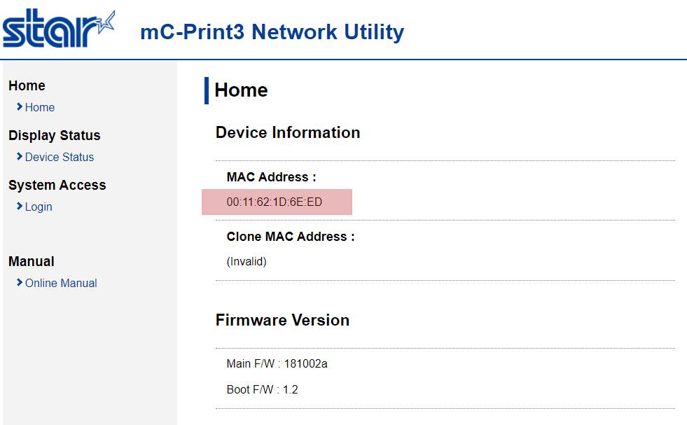
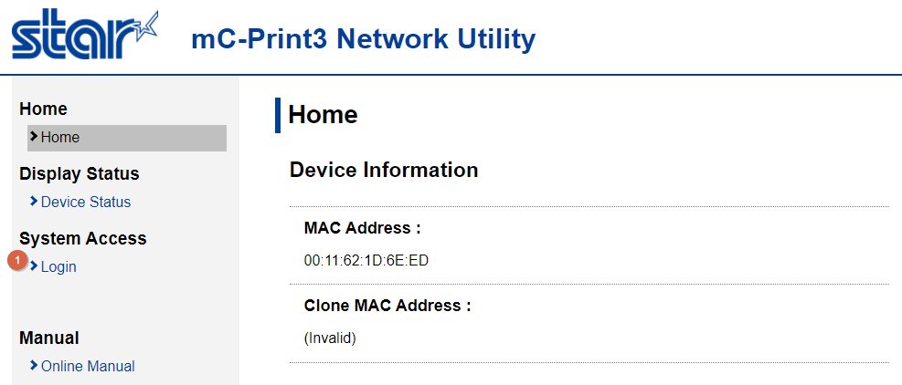
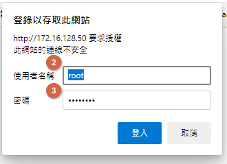
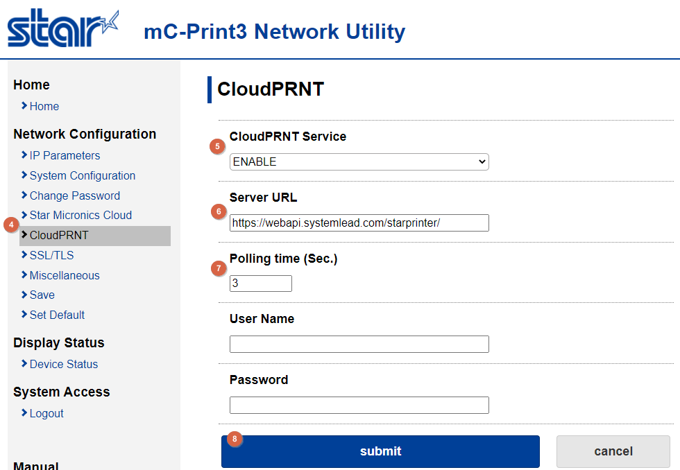
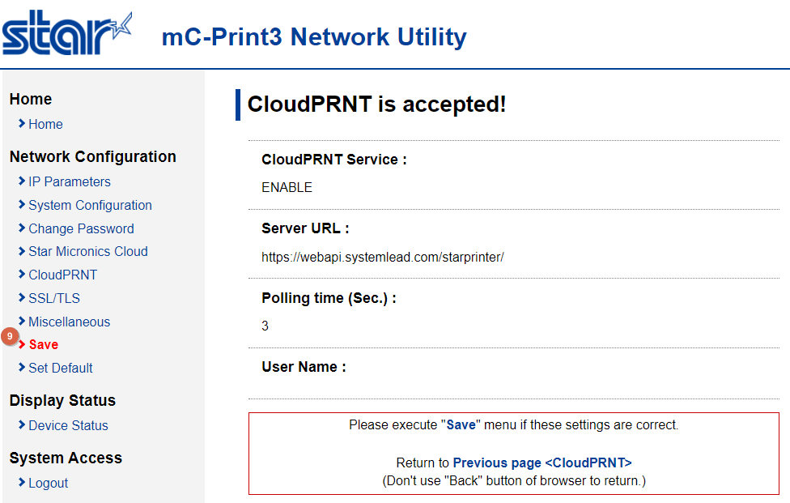
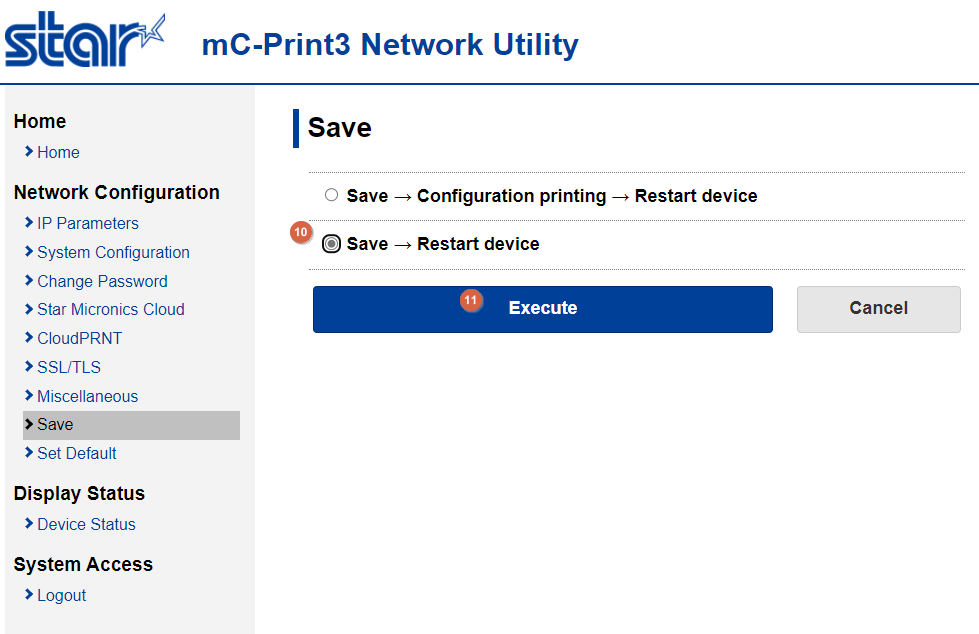

## 設定StarPrinter請先將印表機接上電源並且連接網路.

### 階段1. 查詢 MAC Address 並將紅框處回報[e首發票]客服註冊 
#### 此階段需先將MAC Address(紅色框選處) 回報[e首發票]客服，確認系統註冊完成後，再進行階段2步驟。

## 請務必完成階段1步驟且待[e首發票]客服通知再進行階段2步驟.

### 階段2. 設定啟用雲端列印

#### Step1. 登入系統

##### (1)點選[Login]

#### Step2. 輸入使用者名稱

##### (2)使用者密碼：輸入[root]
##### (3)密碼：輸入[public(預設)]

#### Step3. 啟用雲端列印  

##### (4) 點選 [CloudPRNT]
##### (5) CloudPRNT Service：選擇 [ENABLE]
##### (6) Server URL：輸入 [https://webapi.systemlead.com/starprinter/]
##### (7) Polling time(Sec.)：修改為 [3]
##### (8) 點選 [Submit]

#### Step4. 儲存設定

##### (9) 點選 [Save]

#### Step5. 重啟印表機

##### (10) 選擇 [Save -> Restart device]
##### (11) 點選 [Execute]

## 重啟後請回報[e首發票]客服，並且[e首發票]客服會協助進行列印測試.
